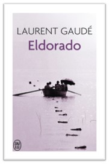

+++
title = "Eldorado de Laurent Gaude - critique sur le livre"
date = "2024-01-09"
draft = false
pinned = false
image = "eldorado.jpg"
description = ""
+++
# L’Auteur :

L’auteur du livre Eldorado est Laurent Gaudé. Il est né en 1972 à Paris, France. À l’université de Paris il a étudié littérature et théâtre et en 1997 il a publié son premier théâtre “Onysos le furieux”. Des autres pièces des théâtre suivait, puis il a commencé d’écrire des romans. Il a gagné plusieurs prix littéraires, par exemple le prix Goncourt, le prix des livres européens et le prix de littérature de Euregio (l’Euregio est un prix dont le jury consiste uniquement des élèves) pour le livre Eldorado. 
Thème :
Le livre se trait intensivement de le voyage des clandestins. On encontre des différent aspects et les voit avec deux perspectives : une fois par les yeux d’un capitaine Européen et une fois par les yeux d’un clandestin. Quelques aspects seraient :
•	Les passeurs
•	Les risques et dangers du voyage
•	La mentalité de chaque côté (l’Europe/les clandestins)
Le texte est une bonne opportunité pour apprendre plus sur la situation et pour gagner une nouvelle perspective sur le sujet

# Résumé courte (sans spoiling)

Il y a deux histoires qui se finalement croissent avec un personnage principal pour chaque perspective. Un de les deux est Salvator Piracci, un commandent qui habite à Catane (Sicile). Il est un officier de marine est surveilles les illégales immigrants clandestins qui arrivent à Lampedusa. Soleiman et Jamal sont des frères qui habitent à Afrique du Nord. Ils quittent ses vies en Afrique et essayent d’aller à l’Europe. 

# Micro-analyse :

Avec cette livre, Laurent Gaudé nous montre l’intérieur des réfugiés. Il veut rendre la dignité à les milles réfugiés. Il nous montre l’histoire avec deux portraits qui s’opposent. Avec ça, il montre diffèrent perspectives sur la souffrance des personnes qui traversent le méditerranée.

Jugement global et la recommandation du groupe
Globalement nous recommandons le livre Eldorado. Nous avons compris bien le texte, mais il avait quelques mots que nous devions traduire. L’action avait quelque de suspense pour lire. 

Sources:
https://de.wikipedia.org/wiki/Laurent_Gaud%C3%A9