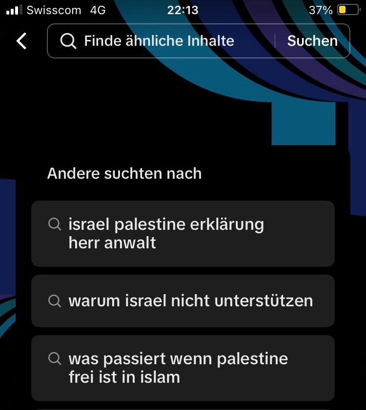

+++
title = "Hauptinformationsquelle der Generation Z - Warum wir dabei kritisch bleiben müssen"
date = "2023-12-21"
draft = false
pinned = false
tags = ["deutsch"]
image = "1627059266060-gettyimages-1234045968.webp"
description = "Social Media, insbesondere Tiktok und Youtube ist eine der Hauptinformationsquellen der Generation Z. Einerseits informieren sich viele Jugendliche auf TikTok über harmlose Urlaubsziele und Restauranttipps, andererseits jedoch auch über politische und gesellschaftlich aktuelle Themen. Problematisch kann dies insofern sein, wenn der Zuschauer oder die Zuschauerin dabei nicht kritisch bleibt."
footnotes = "Quellen: <!--StartFragment-->\n\n<https://marketing.ch/suchmaschinenmarketing/ist-tiktok-die-neue-suchmaschine-fuer-gen-z/>\n\nTitelbild: https://www.vice.com/en/article/pkbxm9/tiktok-blackout-challenge-kill-children \n\n<!--EndFragment-->"
+++
<!--StartFragment-->

Social Media, insbesondere Tiktok und Youtube ist eine der Hauptinformationsquellen der Generation Z. Einerseits informieren sich viele Jugendliche auf TikTok über harmlose Urlaubsziele und Restauranttipps, andererseits jedoch auch über politische und gesellschaftlich aktuelle Themen. Problematisch kann dies insofern sein, wenn der Zuschauer oder die Zuschauerin dabei nicht kritisch bleibt. 

Kritisches Denken ist, besonders jetzt im digitalen Zeitalter, ein sehr wichtiges Thema, weshalb wir es im Deutschunterricht behandelt haben. Das kritische Denken ist ein aktiver Prozess, der mit logischen Schlüssen und faktenbasierten Daten zu einem Urteil gelangt. Logische und kognitive Fehlschlüsse sollen erkannt und vermieden werden. Ich werde jedoch in diesem Blog nicht weiter auf das kritische Denken an sich eingehen, sondern an einem Beispiel die Relevanz dessen zeigen. 

Im Internet bzw. auf TikTok wimmelt es nur von Informationen. Gemäss einer Studie von NewsGuard liefern jedoch knapp 20% der TikTok Suchanfragen Fehlinformationen. Im Unterschied zu Informationen auf offiziellen Medien wie der Tagesschau, die journalistisch erarbeitet werden, existiert auf Social Media viel des sogenannten UGC (User Generated Content), die oft Fehlinformationen enthalten und verbreitet werden. Wie es der Name sagt, kann UGC von jedem, sei er oder sie noch so unqualifiziert, veröffentlicht werden. Durch die mögliche Anonymität haben diese Menschen oft keine Folgen. Deshalb ist es wichtig, die Quelle der Information zu überprüfen, insbesondere auf Social Media.

Kritische Hinterfragung ist nicht nur bei Videos sondern auch bei deren Kommentaren nötig. Diese können nämlich einen grossen Einfluss auf die Meinungsbildung einer Person haben.  Nach dem Anschauen eines Videos, gehen viele die Kommentare durch, um zu schauen, was die anderen denken. Dabei ist nicht der wahrheitsgetreuste Kommentar zuoberst, sondern der am meisten gelikte. Oft sind diese Top-Kommentare die radikaleren und polarisierenden. Durch das Internet ist eine riesige Menge an Kommunikation möglich, folglich auch eine riesige Menge an radikaler Propaganda und auch Fake oder verzerrte News. Beim durchlesen der Kommentare ist stets zu beachten, dass nur eine kleine Menge der User überhaupt Kommentare verfasst. Oft sind dies eben, wie oben erwähnt, die radikalen Meinungen, bei denen Vorsicht geboten ist. Ein Suchvorschlag der mich zum Denken angeregt hat war folgender: "warum Israel nicht unterstützen". Die Antwort auf eine solche Frage sollte man nicht auf einer solchen Plattform suchen bzw. finden, sondern sich bei einer seriösen Quelle informieren und eine eigene Meinung bilden. Einfacher ist jedoch zu denken, was andere schreiben und viele liken. Bei Restaurantempfehlungen wird dies wohl nicht gravierend sein, doch für die Verbreitung von politisch radikalen Meinungen oder Verschwörungstheorien könnte dies schwerwiegendere Folgen haben.

Folglich sollten Videos, Kommentare, Suchvorschläge grundsätzlich kritisch hinterfragt werden (Wer sagt das, Warum sagt er/sie das, Was ist der Hintergrund, Was ist der Zweck). Insbesondere sollte man bei politische Informationen auf Social Media skeptisch sein und sich bei offiziellen Medien darüber informieren.

<!--EndFragment-->

 Diesen Text habe ich mithilfe von meinen Notizen, dem Word-Korrekturprogramm und Formulierungsvorschläge von ChatGPT verfasst. Bei der Thematik habe ich mich von dem Youtubevideo von Jonas Ems "TOP KOMMENTAR, eine unterschätzte Gefahr..." inspirieren lassen. 