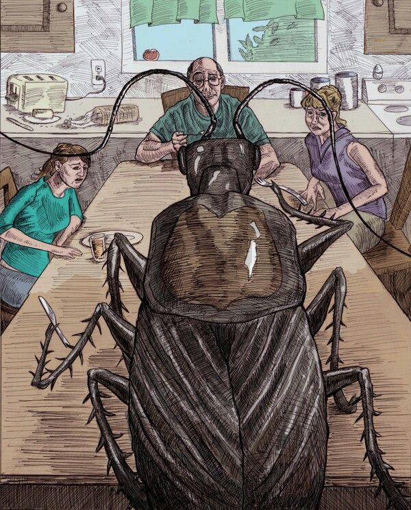

+++
title = "POV*: enormes Ungeziefer"
date = "2024-05-25"
draft = false
pinned = false
tags = ["deutsch", "kafka"]
image = "whatsapp-image-2024-05-26-at-13.16.40_0e42ec1d.jpg"
footnotes = "Titelbild: https://knowyourmeme.com/editorials/guides/would-you-still-love-your-girlfriend-if-she-were-a-worm-the-age-old-question-plaguing-boyfriends-explained\n\n\\*POV bedeutet Point of view und wird in der Jugendsprache und im Internet verwendet, um auszudrücken aus welchem Blickwinkel man schaut. Hier möchte ich aus der Perspektive eines Ungeziefers sprechen."
+++
<!--StartFragment-->

Als ich eines Morgens aus einem seltsamen und unruhigen Traum von Ungeziefer erwachte, war ich selbst tatsächlich keines. Mir fiel jedoch kurz darauf ein, dass ich in meinem Traum ein Ungeziefer war und verhungerte. Meine logische Anschlussfrage darauf war: Was, wenn ich als Ungeziefer aufgewacht wäre?

Zuerst ein wenig Kontext: „Als Gregor Samsa eines Morgens aus unruhigen Träumen erwachte, fand er sich in seinem Bett zu einem ungeheuren Ungeziefer verwandelt.“ Das ist der berühmte Anfang von Kafkas Buch „die Verwandlung“, welches wir im Deutschunterricht behandelten. Dank meinem grandiosen Zeitmanagement las ich an jenem Abend, kurz bevor ich schlafen ging, einen grossen Teil des Buches, was auch meine Träume prägte.

> Was, wenn ich als Ungeziefer aufgewacht wäre?

Gregor Samsa wacht auf und ist ein Ungeziefer. Erstmals fragt er sich, was mit ihm geschehen ist. Ziemlich schnell aber drehen sich seine Gedanken nur noch um seine Arbeit, zu der er zu spät kommen würde, weil er verschlafen hat. Samsa denkt gar nicht daran, dass er ein Ungeziefer ist und deshalb ganz andere Probleme hat. Soziale Normen, die erwartet werden. Samsa denkt mehr ans Arbeiten statt ans Ungeziefersein. Dieser Wiederspruch wird gar nicht thematisiert. Deshalb fragte ich mich, wie würde ich in Samsa Situation handeln? Oder um zurück zu meiner Anfangsfrage zu kommen: Was, wenn ich als Ungeziefer aufgewacht wäre?

Erstmals wäre ich geschockt und ungläubig des gegenwärtigen Zustandes. Ziemlich bald wäre meine Mutter in meinem Zimmer, um sicherzugehen, dass ich wach bin. Sie wäre vermutlich auch geschockt und äusserst besorgt. Es bräuchte sicherlich einige Zeit, bis sich alle an meinen Zustand gewöhnen. Ich würde mir schnell die Frage stellen: Was mache ich jetzt?

Mein Leben würde sich drastisch verändern. Einerseits wäre ich nicht mehr in der Lage viele meiner Tätigkeiten wie gewohnt zu machen, wie zum Beispiel Tanzen oder einfach in die Schule zu gehen. Andererseits wäre meine Kommunikation massiv eingeschränkt. Das heisst, ich könnte nicht mehr mit meinen Freund*innen und meiner Familie sprechen. Ziemlich schnell wäre ich wahrscheinlich in einer Sinnkrise, in der ich mich fragen würde, wofür es sich als Ungeziefer zu leben lohnt. Vermutlich würde mein Leben einfach ganz anders aussehen und nach einem langen Trauerprozess um mein altes Leben würde ich sicherlich neue Beschäftigungen finden.

Eine andere Frage, die ich mir stellte, ist: Wer würde zu mir halten, wenn ich ein Ungeziefer wäre? Als ich mit meiner Kollegin über Gott und die Welt sprach, kam auch dieser Deutschauftrag auf und ich erklärte ihr, was meine Idee diesbezüglich war. Daraufhin meinte sie: „Wärst du ein Käfer würde ich dich füttern, dir eine Schleife umbinden und dich in meine Vorlesungen mitnehmen.“ Eine andere meinte: „Ich würde dich füttern und deinen Panzer mit Glitzersteinen bekleben.“ Meine Mutter erklärte mir: „Ich würde dich gerne haben und versuchen mit dir zu sprechen, dich füttern etc. Das ist bedingungslose Liebe, die nur Eltern haben.“ Diese Frage erinnerte mich stark an den Social Media Trend „Would you still love me if i was a worm?“ Das ist eine Klischee Frage, die Freundinnen ihren Freunden stellen, um zu sehen, wie sehr sie sie wirklich liebem, abgesehen von dem Äusserlichen.

Schlussendlich ist diese Frage äusserst individuell zu beantworten. Jedoch bin ich der Ansicht, wir sollten uns alle mal vorstellen ein Ungeziefer zu sein, um einfach das, was man hat, mehr wertzuschätzen. Ich bin sehr dankbar, dass ich kein Ungeziefer bin.

<!--EndFragment-->

 Diesen Text habe ich lediglich mit Hilfe des Word-Korrekturprogramms, meinen Unterrichtsnotizen und dem Text "die Verwandlung" geschrieben. 

